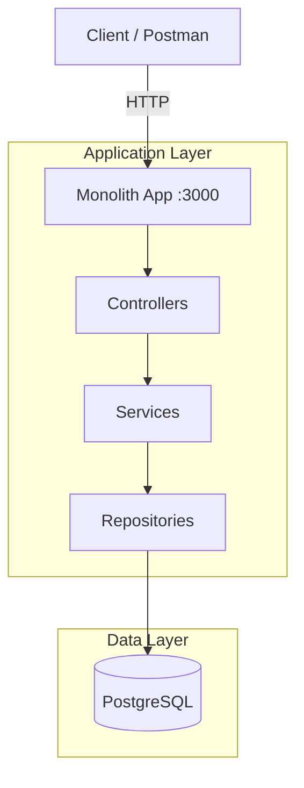

# Stocks Monolith Backend

A production-ready monolithic backend for a stocks trading platform.

## Architecture



## Tech Stack & Decisions

| Technology | Role | Why we chose it |
|------------|------|-----------------|
| **Node.js 22 & Express 5** | Runtime & Framework | High performance, non-blocking I/O. Express 5 provides better error handling and native Promise support. |
| **TypeScript** | Language | Type safety reduces runtime errors and makes the codebase self-documenting for larger teams. |
| **Prisma ORM** | Data Access | Type-safe database queries and automated migrations. Simplifies the "Clean Architecture" repository pattern. |
| **Zod** | Validation | Ensures that every request body is strictly validated before reaching the business logic. |
| **Winston** | Logging | Production-grade structured logging (JSON) for better monitoring and debugging. |
| **PostgreSQL** | Database | A robust, ACID-compliant relational database suitable for financial transactions (trades/holdings). |

## Monolith vs. Microservices

| Feature | Monolith (This Repo) | Microservices |
|---------|----------------------|----------------|
| **Deployment** | Single unit; simple CI/CD. | Multiple units; requires orchestration (K8s/Compose). |
| **Performance** | Nano-second function calls. | Milli-second network latency between services. |
| **Scaling** | Scale the whole app. | Scale only the heavy services (e.g., Stocks). |
| **Complexity** | Low; single codebase. | High; requires service discovery & event buses. |
| **Data** | Single shared database. | Isolated databases per service (harder joins). |

**Ideal Use Case**: This monolith is perfect for MVP development, small teams, and apps where performance and simplicity outweigh the need for independent scaling of components.

## Quick Start

### 1. Setup Environment
```bash
cp .env.example .env
```

### 2. Run with Docker
```bash
docker compose up -d --build
```

### 3. Initialize Database
Once the containers are running:
```bash
npm install
npx prisma migrate dev
npx prisma db seed
```

### 4. Development (Local)
If you prefer running the app locally:
```bash
npm run dev
```

## API Endpoints

### Auth
- `POST /api/auth/register` - Create user
- `POST /api/auth/login` - Get JWT token

### Stocks & Trading (Protected)
- `GET /api/stocks` - List all stocks
- `POST /api/trade` - Execute a trade (`BUY` or `SELL`)
- `GET /api/portfolio` - View user holdings

## Why Monolith?
This approach is ideal for:
- **Simplicity**: Single codebase, easier deployment, and lower operational overhead.
- **Performance**: Local function calls instead of network overhead (RPC/HTTP) between services.
- **Consistency**: Easier to handle database transactions across multiple domains.

Perfect for the initial phase of a project before scaling into the microservices architecture demonstrated in the parent folder.
